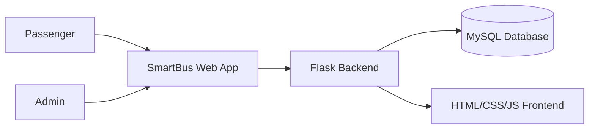
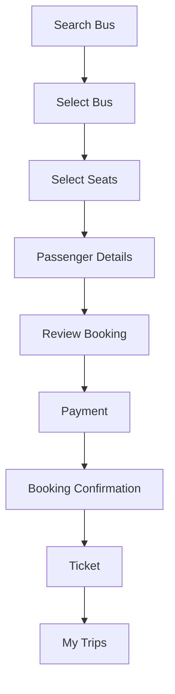
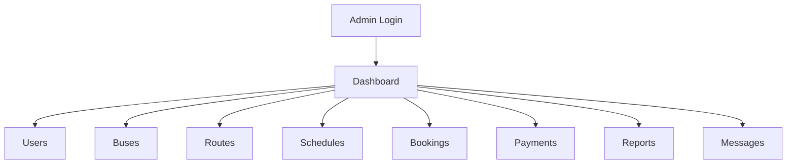
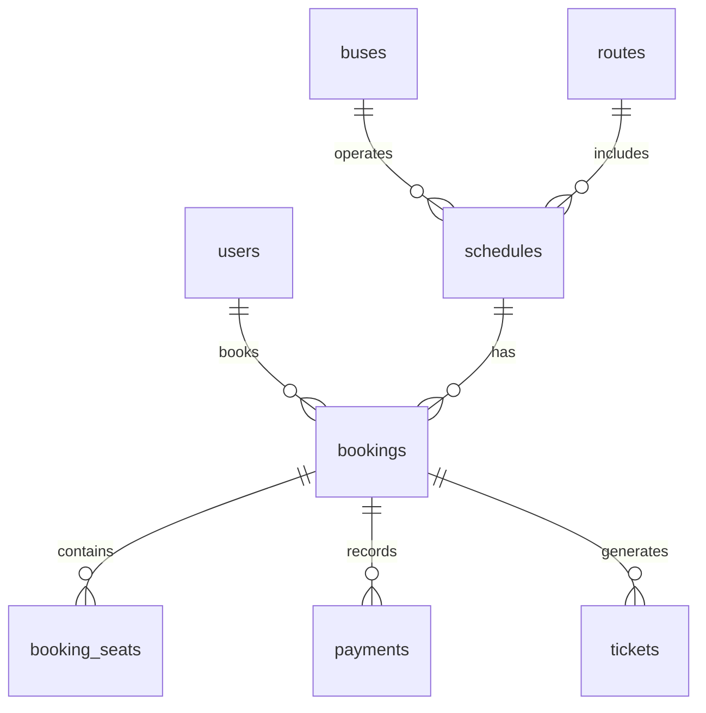

# SmartBus Maharashtra

A Maharashtra-focused web application for bus search, booking, ticket management, and admin operations.

## Overview
SmartBus Maharashtra is a Flask-based bus booking platform built for travel across Maharashtra. Passengers can search for routes, select seats, review booking details, complete simulated payment, and access their trip history. Administrators can securely manage users, buses, routes, schedules, bookings, payments, and support messages.

The project keeps the original application structure intact while making it safe for local development and deployment-oriented configuration. The shipped MySQL schema is preserved as-is and the application code adapts to it without changing the database file.

## Features

### Passenger
- account registration
- login and logout
- bus search by source, destination, and date
- All Services route listing
- seat selection
- passenger details capture
- booking review
- simulated payment
- booking confirmation
- ticket generation
- My Trips
- My Tickets
- ticket printing
- cancellation
- profile updates
- contact form

### Admin
- secure admin login
- dashboard
- user management
- bus management
- route management
- schedule management
- booking review
- payment records
- reports
- contact messages

## Technology Stack
- HTML5
- CSS3
- JavaScript
- Python
- Flask
- MySQL
- mysql-connector-python
- Jinja2
- Werkzeug
- Gunicorn

## Architecture Diagram



## Passenger Booking Flow



## Admin Flow



## Database Relationship Diagram



## Project Structure

```text
smartbus-maharashtra/
├── app.py
├── database.py
├── database.sql
├── database1.sql
├── database_backup.sql
├── gen_compact_sql.py
├── requirements.txt
├── README.md
├── .gitignore
├── .env.example
├── templates/
│   ├── admin/
│   ├── 403.html
│   ├── 404.html
│   ├── about.html
│   ├── all_services.html
│   ├── base.html
│   ├── booking_confirmation.html
│   ├── booking_review.html
│   ├── booking_success.html
│   ├── bus_results.html
│   ├── contact.html
│   ├── dashboard.html
│   ├── error.html
│   ├── index.html
│   ├── login.html
│   ├── my_bookings.html
│   ├── my_tickets.html
│   ├── my_trips.html
│   ├── passenger_details.html
│   ├── payment.html
│   ├── profile.html
│   ├── register.html
│   ├── results.html
│   ├── search_bus.html
│   ├── search.html
│   ├── seat_selection.html
│   ├── ticket.html
│   └── user_dashboard.html
├── static/
│   ├── css/
│   ├── images/
│   └── js/
└── screenshots/
```

## Local Setup (Windows)

```powershell
python -m venv venv
venv\Scripts\activate
pip install -r requirements.txt
python app.py
```

Then:

1. Start MySQL.
2. Open MySQL Workbench or a MySQL client.
3. Import the existing `database.sql` file without changing it.
4. Configure local environment variables or the default local values in `database.py`.
5. Open the app at http://127.0.0.1:5000

The project is designed to keep local development working while allowing production values to be supplied through environment variables.

## Environment Variables

The application uses the following environment variable names:

- MYSQL_HOST
- MYSQL_PORT
- MYSQL_USER
- MYSQL_PASSWORD
- MYSQL_DATABASE
- SECRET_KEY

Example:

```env
MYSQL_HOST=localhost
MYSQL_PORT=3306
MYSQL_USER=root
MYSQL_PASSWORD=
MYSQL_DATABASE=smartbus_mh
SECRET_KEY=change-me
```

## Production / Render Deployment

This project is prepared for a simple Python deployment flow:

```text
GitHub
  ↓
Render Web Service
  ↓
Aiven MySQL
```

Recommended Render configuration:

- Service Type: Web Service
- Runtime: Python
- Build Command: pip install -r requirements.txt
- Start Command: gunicorn app:app
- Branch: main
- Environment variables: MYSQL_HOST, MYSQL_PORT, MYSQL_USER, MYSQL_PASSWORD, MYSQL_DATABASE, SECRET_KEY

The application uses simulated payment flows and does not perform real financial transactions.

## Database Setup

The shipped `database.sql` file is the project database and must remain unchanged. Use it to initialize the local or hosted MySQL database. For Aiven MySQL, the service connection information is supplied as environment variables and the same schema can be imported into the hosted database without modifying the SQL file.

## Testing

The following flows are part of the current application behavior and were validated as project functionality:

- registration
- login
- search
- route listing
- seat selection
- booking
- payment simulation
- ticket generation
- My Trips
- My Tickets
- cancellation
- admin login
- admin access control

## Limitations

- payment is simulated only
- no real payment gateway is integrated
- no live GPS tracking is implemented
- Render and Aiven availability depend on external service configuration

## Deployment Notes

- The application should run with `gunicorn app:app` in production.
- Local development may continue using `python app.py`.
- `debug=True` is not used in production configuration.
- Secret values are not committed to GitHub and should be provided through environment variables on Render.
